# RT03 BLE Beacon Series

|Date|Version|Description|
|---|---|---|
|December 2019|3|Added Battery Service and OTA Update Information|
|October 2019|2|Added OTA and Service Information|
|October 2019|1|First Draft|

---

<!-- toc -->

## Table of Content

- [RT03 BLE Beacon Series](#rt03-ble-beacon-series)
	- [Table of Content](#table-of-content)
	- [Product Overview](#product-overview)
	- [Product Specification](#product-specification)
	- [Beacon](#beacon)
		- [Beacon Major Minor Value Conversion](#beacon-major-minor-value-conversion)
	- [Services](#services)
		- [1. Secure DFU(Device Firmware Upgrade) Service](#1-secure-dfudevice-firmware-upgrade-service)
		- [2. Battery Service](#2-battery-service)
		- [3. Environmental Sensing Service](#3-environmental-sensing-service)
	- [Application Example](#application-example)
		- [Prerequisite](#prerequisite)
		- [Scanning Beacon](#scanning-beacon)
		- [Connecting Tag](#connecting-tag)
		- [Enquiring Environmental Data](#enquiring-environmental-data)
		- [Enquiring Battery Level](#enquiring-battery-level)
		- [OTA Firmware upgrade](#ota-firmware-upgrade)

---

## Product Overview

RT03 Series are BLE beacon tags. It also comes with various models providing environmental monitoring service including temperature and humidity data sensing.

|Item|Description|
|---|---|
|HKRAT-RT03-0|BLE Beacon|
|HKRAT-RT03-IT|BLE Beacon with temperature sensor|
|HKRAT-RT03-H|BLE Beacon with temperature and humidity sensor|

---

## Product Specification

Softdevice Version: `v6.1.1`

Bootloader Version: `v1`

Application Version: `v3.3`

|Item|RT03|TT03|HT03|
|---|---|---|---|
|Battery Life (60% Battery)|5.5 years|4 years|2.5 years|
|Temperature Range (&deg;C)|-|-30 - 80|-20 - 80|
|Temperature Resolution (&deg;C) |-|0.06|0.5|
|Humidity Range|-|-|0% - 100%|
|Humidity Resolution|-|-|1%|

---

## Beacon

Beacon Interval: 3 seconds

Beacon UUID: MAC Address(12) appended with 0s

Example:

>d4f0068a-5d5d-0000-0000-000000000000

|Item|Type|Description|
|---|---|---|
|Major|sint16|Temperature in degrees Celsius|
|Minor|sint16|Himidity percentage|

### Beacon Major Minor Value Conversion

Major (Temperature)
> temperature(&deg;C) = (sint)(major value) / 100

Minor (Humidity)
> humidity(%) = (sint)(minor value) / 100

Example:

```txt
Major Value = (uint16)2450
(uint16)2450 = 0x992 = (sint16)2450 / 100 = 24.5 C

Major Value = (uint16)64636
(uint16)64636 = 0xFC7C = (sint16)-900
temperature = -900 / 100 = -9 C

Minor Value = (uint16)5700
(uint16)5700 = 0x1644 = (sint)5700
humidity = 5700 /100 = 57 %
```

Minor (Humidity)

>(sint) minor value / 100 %

Example:

>5000 / 100 = 50 %

---

## Services

|Services|UUID|Description|Remarks|
|---|---|---|---|
|[Secure DFU Service](#1-secure-dfudevice-firmware-upgrade-service)|`0xFE59`|OTA firmware update||
|[Battery Service](#2-battery-service)|`0x180F`|Battery level||
|[Environmental Sensing Service](#3-environmental-sensing-service)|`0x181A`|Measurement from environmental sensor(s)|Only available for HKRAT-RT03-IT or HKRAT-RT03-H|

### 1. Secure DFU(Device Firmware Upgrade) Service

This service enables OTA(Over The Air) firmaware upgrade. For detailed procedures of OTA firmware upgrade, please refer to the example [OTA Firmware Upgrade](#ota-firmware-upgrade).

Service UUID: `0xFE59`

### 2. Battery Service

Service UUID: `0x180F`

This service exposes the battery level.

|Characteristic|UUID|Type|Prop|Description|
|---|---|---|---|---|
|Battery Level|`0x2A19`|int16|read only|Battery level percentage|

### 3. Environmental Sensing Service

Only available on `HKRAT-RT03-IT` and `HKRAT-RT03-H`

Service UUID: `0x181A`

This service exposes measurement data from environmental sensor(s).

|Characteristic|UUID|Type|Prop|Description|
|---|---|---|---|---|
|Temperature|`0x2A6E`|sint16|read only|Temperature in degrees Celsius|
|Humid|`0x2A6F`|sint16|read only|Humidity percentage|
---

## Application Example

We will use `HKRAT-RT03-H` with MAC address `D4:F0:06:8A:5D:5D` through out this example.

### Prerequisite

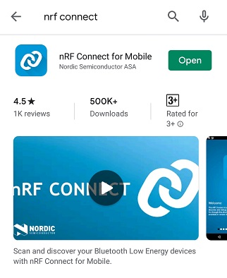

You will need the application `nRF Connect for Mobile` issued by the Nordic Semiconductor. You may get it from the App Store (iOS) or Google Play Store (Android).

### Scanning Beacon

First open the `nRF Connect` app. You should be in the SCANNER tab. In this page, you can see BLE devices that are advertsing. Press `SCAN` at the top right corner to start scanning ble devices.

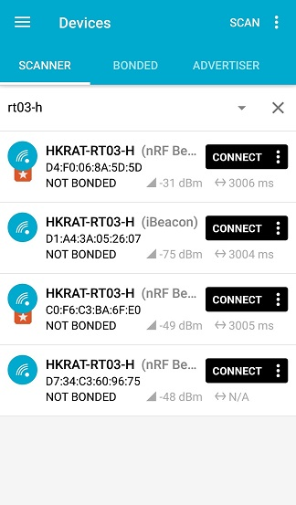

You can tap on any device to show more information.

We are looking for `HKRAT-RT03-H` with MAC address `D4:F0:06:8A:5D:5D` and UUID `d4f0068a-5d5d-0000-0000-000000000000`.

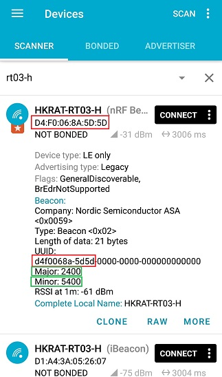

You should be able to see the Beacon details. The temperature and humidity value are broadcasted through the major and minor value.

Since the major and minor are showing unsigned raw data, you need to convert the data to get the actual value. You may refer to [Beacon Major Minor Value Conversion](#beacon-major-minor-value-conversion) section.

### Connecting Tag

Now, let's connect to the `HKRAT-RT03-H` by pressing the connect button.

After connected to the tag, you should see the services available from the tag.

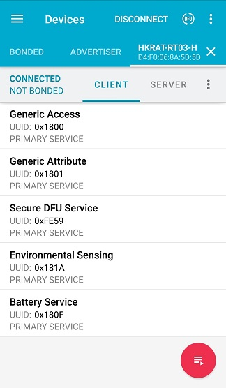

### Enquiring Battery Level

The [Battery Service](#2-battery-service) shows the battery level. Tap on it to reveal more information.

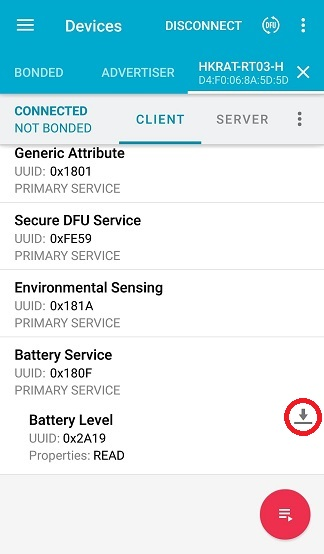

By tapping on the down arrow button, you should be able to read the battery level.

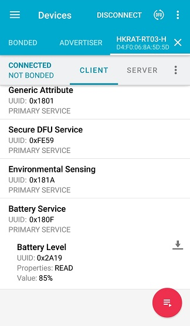

### Enquiring Environmental Data

The [Enviromental Sensing Service](#3-enviromental-sensing-service) is the BLE service that contain the data we need. Tap on it to reveal more information.

You should now see the `Temperature Characteristic (0x2A6E)` and the `Humidity Characteristic (0x2A6F)`.

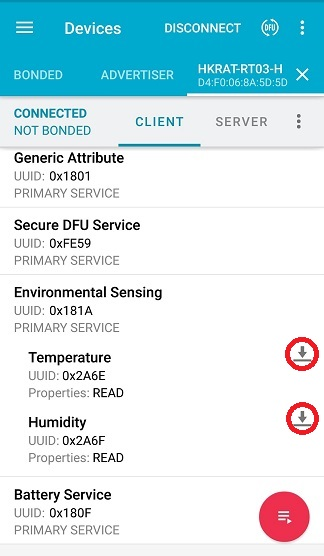

By tapping on the down arrow button, you should be able to read the current temperature and humidity values.

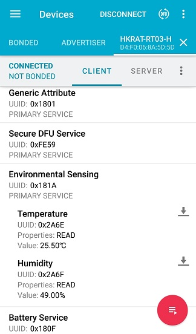

---

### OTA Firmware upgrade

First connect to the target device.

Remember the MAC address of the tag. In this case the MAC address is `D4:F0:06:8A:5D:5D`.

Tab on the `Secure DFU Service`.

Tab on the double arrow to enable indication.

Tab on the up arrow. When prompt, choose `request` from the drop down menu the press `Send`.

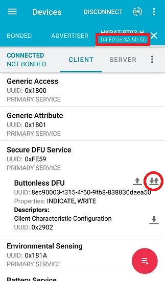

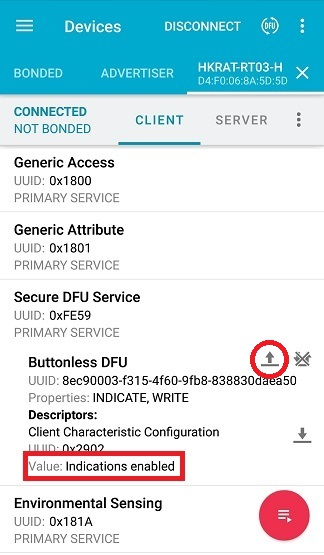

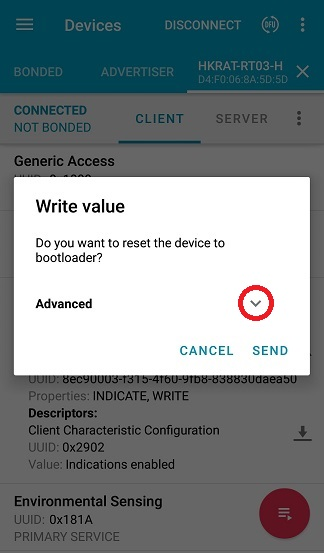

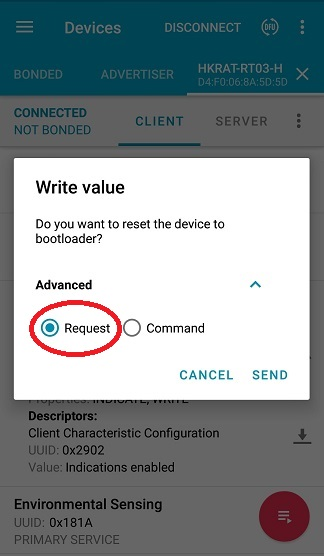

The tag will reboot in dfu mode and the current connection will be lost. If the tag entered DFU mode successfully, the blue LED will lit (TT03 and HT03 only).

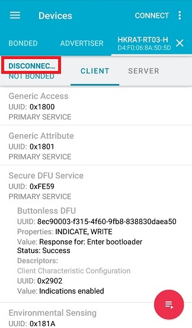

Go back to SCANNER tab. You should find one device with Name `DfuTarg` and with a MAC address incresed by 1 of your target device. In this case the MAC address is `D4:F0:06:8A:5D:5E`.

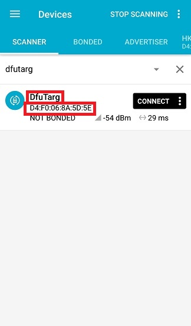

Connect to the `DfuTarg`.

Tap on the DFU button.

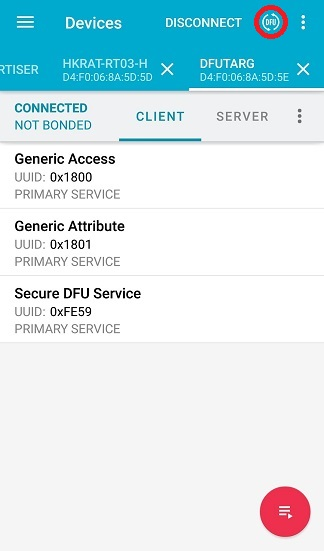

Select `Distribution packet(ZIP)`

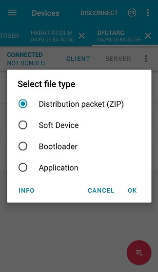

Select the corresponding firmware file, in this example the file is `rt03-H-v3.3-dfudemo.zip`.

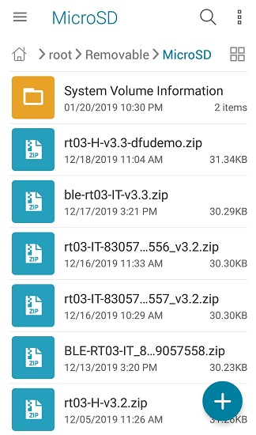

After selected the file, the DFU update will automactically start.

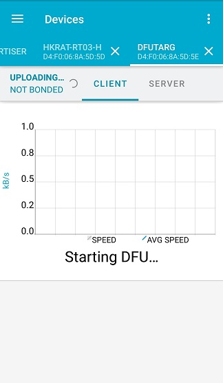

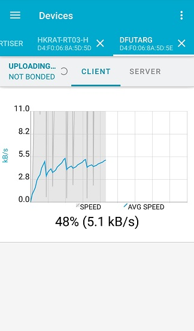

When the progress is 100%, the firmware update process is done.
